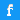

<html lang="pt-br">
      <head>
        <meta charset="UTF-8">
        <link rel="shorcut icon" href="imagens/favicon.ico">
        <title>Meu Portfólio</title>
        <link rel="stylesheet" href="style.css">
      </head>
      <body>
        <header>
        
          <h1>Gabriel Kostik</h1>
          <nav>
            <ul>
              <li><a href="#sobre">Sobre</a></li>
              <li><a href="#projetos">Projetos</a></li>
            </ul>
          </nav>
        </header>
        <main>
          <section id="sobre">
            <h2>Sobre</h2>
            
Proativo, adaptativo, organizado, analítico, estrategista, prezo pela qualidade, mas estou aberto para novos desafios. Tenho conhecimento em programação como C, HTML5, CSS3, PHP e Javascript. Conhecimento em frameworks e linguagens NodeJs e Angular. Experiência em ensino de Informática, tento facilidade para explicação e esclarecimento de dúvidas relacionado a área. Conhecimento em pacote Office, Photoshop e Illustrator, programação de jogos, design, modelagem e criação de aplicativos para celular.

          </section>
          <section id="projetos" class="projetos">
            <h2>Projetos</h2>
            

              <h3>Projeto 1</h3>
              
Um site básico de HTML5/CSS3 sobre o sistema operacional Android e suas curiosidades

              <a href="https://kostikgs.github.io/projeto-android/">Ver projeto</a>
            

            

              <h3>Projeto 2</h3>
              
Site Cordel, com uso de Parallax em imagens

              <a href="https://kostikgs.github.io/html5/modulo3/d012/">Ver projeto</a>
            

            

              <h3>Projeto 3</h3>
              
Site com links para minhas redes sociais, usando iframes, tendo um celular como tela para os sites

              <a href="https://kostikgs.github.io/projeto-social/">Ver projeto</a>
            

          </section>
        

         <a href="https://www.facebook.com/gabriel.kostik/" target="_blank" rel="external">Facebook</a>
         <a href="https://twitter.com/GS_Kostik" target="_blank" rel="external">Twitter</a>
         <a href="https://www.linkedin.com/in/gabriel-kostik-3b539b163/" target="_blank" rel="external">Linkedin</a> 
         <a href="https://github.com/KostikGS" target="_blank" rel="external">Github</a> 

        </main>
        <footer>
          

Desenvolvido por Gabriel Kostik

        </footer>
    </body>
</html>